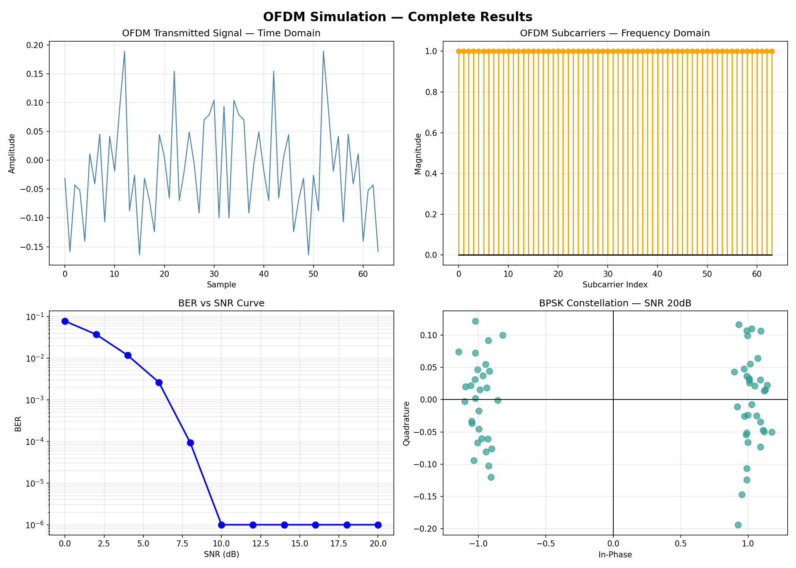
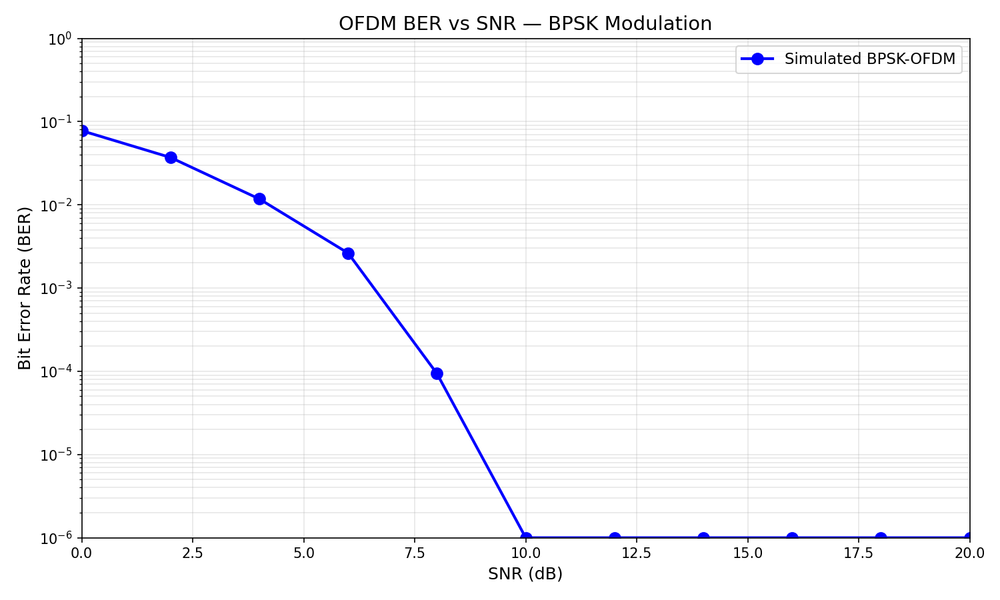
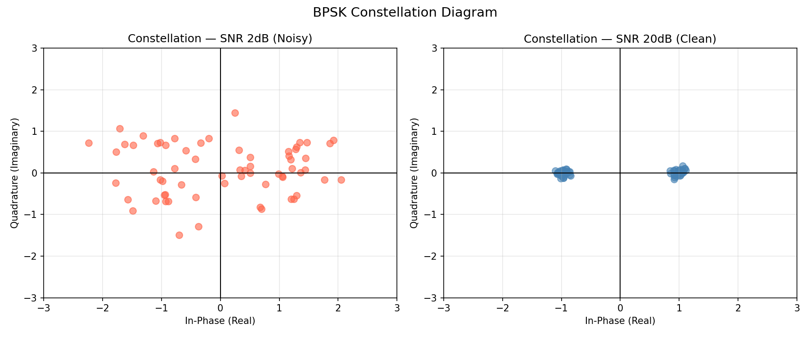

# 📡 OFDM Modulation Simulation

> BPSK modulation · IFFT/FFT transceiver · 
> AWGN channel · BER vs SNR analysis

---

## 📊 Results

### Complete OFDM System Results


### BER vs SNR Curve


### Constellation Diagram


---

## ✨ What this simulates

- 📡 Complete OFDM transceiver — transmitter + channel + receiver
- 🔢 BPSK modulation — maps bits to symbols (-1/+1)
- 📶 64 subcarriers — parallel frequency lanes
- 🔊 AWGN noise channel — realistic wireless simulation
- 📈 BER vs SNR curve — system performance analysis
- 🎯 Constellation diagram — visual proof of noise effect

---

## 🧠 Key Concepts

| Concept | Implementation |
|---------|---------------|
| BPSK Modulation | 0→-1, 1→+1 mapping |
| OFDM Transmitter | IFFT puts symbols on subcarriers |
| AWGN Channel | Gaussian noise added to signal |
| OFDM Receiver | FFT recovers symbols from subcarriers |
| BER Calculation | Wrong bits / total bits sent |
| SNR Threshold | System error-free above 10dB |

---

## 📈 Key Results

- System becomes **error-free at 10dB SNR**
- BER drops from 0.077 at 0dB to 0.000 at 10dB
- 1000 trials × 11 SNR points = 704,000 bits tested
- Constellation shows clear separation at high SNR

---

## 🛠️ Tech Stack

Python · NumPy · Matplotlib · Google Colab

---

## ▶️ How to Run

```bash
# All standard libraries — no extra install needed
pip install numpy matplotlib
```

Open notebook in Google Colab and run all cells.

---

## 👩‍💻 Built by

**Aagya** — EEE/ECE @ Kathmandu University

[](https://github.com/aagya-dsp)
